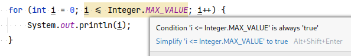

= Инспекции Intellij IDEA

Инспекции Intellij IDEA подсвечивают ошибки в коде.

.Пример предупреждения -- бесконечный цикл

Цикл работает бесконечно, потому что максимальное значение `int` -- `Integer.MAX_VALUE`.
Прибавьте к нему единицу и получите отрицательное число -- `Integer.MIN_VALUE`.
Оно меньше `Integer.MAX_VALUE` 😯

== Что делает профиль инспекций в этом репозитории

Профиль инспекций включает проверки соответствия кода https://www.oracle.com/technetwork/java/codeconventions-150003.pdf[Java Code Conventions]

Установите профиль, и IDEA подскажет, какие классы, параметры поля и методы названы неправильно.
Примеры -- в таблице:

.Примеры правильных и неправильных имён
|===
| Элемент языка | Правильно ✅ | Неправильно 🚫 | Правило

| Класс
a|
. `HostAndPort`
. `LinkedHashSet`
. `BookOperations`
a|
. `hostAndPort`
. `LINKED_HASH_SET`
. `book_operations`
a|
. Первая буква -- заглавная
. Каждое слово -- с заглавной буквы
. Без нижних подчеркиваний

| Параметр метода, поле, локальная переменная, метод
a|
. `numberOfUsers`
. `collectedProfile`
. `watchedVideos`
a|
. `number_of_users`
. `CollectedProfile`
. `WATCHED_VIDEOS`
a|
. Первая буква -- в нижнем регистре
. Каждое новое слово -- с заглавной буквы
. Без нижних подчеркиваний

| Константа
a|
. `MAX_POINTS`
. `DEFAULT_RESOLUTION`
. `MAX_RETRIES`
a|
. `max_points`
. `DefaultResolution`
. `maxRetries`
a|
. Всё заглавными буквами
. Разделитель -- нижнее подчеркивание

|===

== Как установить

. File
. Settings
. Editor
. Inspections
. Шестеренка
. Import profile
. Выбрать `Nitpicking_inspections.xml`

== Ссылки

* https://www.jetbrains.com/help/idea/code-inspection.html[Code inspections] -- об инспекциях на сайте JetBrains
* https://google.github.io/styleguide/javaguide.html[Google Java Style Guide] -- рекомендации Google
* https://en.wikibooks.org/wiki/Java_Programming/Coding_conventions[Coding conventions] --  Wikibooks
